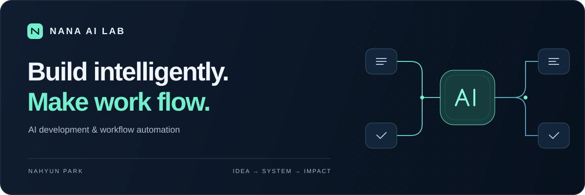



  

<h1 align="center">Nahyun Park · 나나AI랩</h1>

  <strong>AI Developer &amp; Automation Specialist</strong> 
  반복되는 업무를 줄이고, 아이디어를 실제로 쓰이는 AI 서비스로 만듭니다.

  <a href="mailto:nahyunpark5@gmail.com">협업 문의 · Contact</a>

 

## AI that fits the way you work.

안녕하세요. <strong>나나AI랩(NANA AI LAB)</strong>의 개발자 박나현입니다.
AI 서비스 개발과 업무 자동화를 전문으로 합니다.

사람이 반복해서 처리하던 일을 소프트웨어에 맡기고, 사람은 판단과 창의적인 일에 집중할 수 있도록 돕습니다.
업무의 흐름을 이해하는 것부터 시작해, 필요한 AI 기능과 시스템을 연결하고 실제로 사용할 수 있는 서비스로 구현합니다.

I build AI applications and automate repetitive workflows — connecting ideas, data, and tools into useful software.

 

## What I focus on

| Area | 만드는 것 |
| :--- | :--- |
| **AI Applications** | 목적에 맞는 AI 기능을 웹·앱에 연결하는 서비스 개발 |
| **Workflow Automation** | 반복적인 자료 정리, 문서 처리, 콘텐츠 작업을 연결하는 자동화 |
| **System Integration** | API와 데이터를 연결해 도구 사이의 수작업을 줄이는 업무 시스템 |
| **Product Engineering** | 아이디어 구체화부터 구현·배포·개선까지 이어지는 제품 개발 |

 

## How I approach the work

**01 / Understand the workflow** 
어디에서 시간이 소모되는지, 어떤 판단이 필요한지 먼저 파악합니다.

**02 / Build what matters** 
효과를 확인할 수 있는 작은 단위부터 구현하고, 실제 업무에 맞춰 다듬습니다.

**03 / Make it dependable** 
예외 상황과 사람의 확인이 필요한 지점을 고려해, 운영하고 개선할 수 있는 구조를 지향합니다.

 

## Let's make work flow.

AI 기능을 서비스에 넣고 싶거나, 매번 반복하는 업무를 자동화하고 싶다면 이야기해 주세요.
**지금의 작업 방식과 줄이고 싶은 수작업**을 알려주시면 좋은 출발점이 됩니다.

**[AI 개발 · 업무 자동화 협업 문의 →](mailto:nahyunpark5@gmail.com)**

 

---

  <strong>NANA AI LAB · 나나AI랩</strong> AI development. Thoughtful automation.

